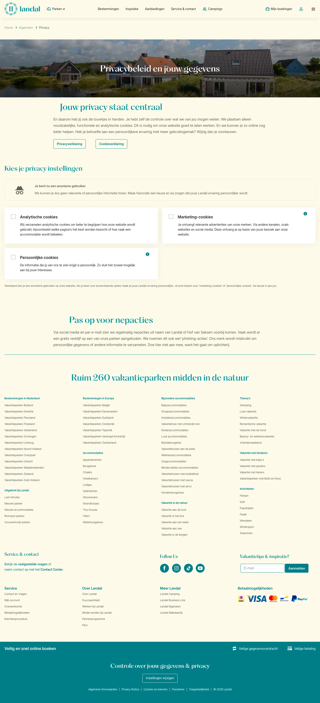

# Privacybeleid en bescherming gegevens

**URL:** `/algemeen/privacy` (page title: "Privacybeleid en bescherming gegevens") · **Occurrences:** 1 page in this run

## Section outline (top to bottom)

1. [Breadcrumb Trail](../components/breadcrumb-trail.md)
2. [Hero Banner with Booking Picker](../components/hero-banner-with-booking-picker.md)
3. [Breadcrumb Trail](../components/breadcrumb-trail.md)
4. [Cookie Consent Settings Panel](../components/cookie-consent-settings-panel.md)
5. [Listing with Filter Sidebar](../components/listing-with-filter-sidebar.md)
6. [Site Footer](../components/site-footer.md)
