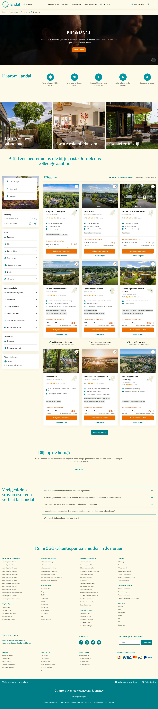

# Met vrienden - Bromance

**URL:** `/campagnes/you-need-this/bromance` (page title: "Met vrienden - Bromance | You need this | Landal") · **Occurrences:** 1 page in this run

## Section outline (top to bottom)

1. [Hero Banner with Booking Picker](../components/hero-banner-with-booking-picker.md)
2. [Quick Link Button Bar](../components/quick-link-button-bar.md)
3. [Accommodation Type Carousel](../components/accommodation-type-carousel.md)
4. [Park Listing with Filter Sidebar](../components/park-listing-with-filter-sidebar.md)
5. [Accommodation Listing with Filter Sidebar](../components/accommodation-listing-with-filter-sidebar.md)
6. [Breadcrumb Trail](../components/breadcrumb-trail.md)
7. [Hero Banner with Booking Picker](../components/hero-banner-with-booking-picker.md)
8. [Site Footer](../components/site-footer.md)
