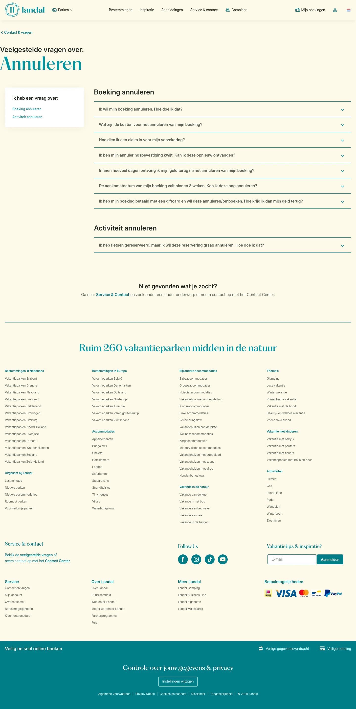

# Boeking of extra's annuleren

**URL:** `/contact-en-vragen/annuleren` (page title: "Boeking of extra's annuleren") · **Occurrences:** 2 pages in this run (also: contact-en-vragen-landal-account-en-landal-app)

## Section outline (top to bottom)

1. [Hero Banner with Booking Picker](../components/hero-banner-with-booking-picker.md)
2. [FAQ Accordion with Topic Menu](../components/faq-accordion-with-topic-menu.md)
3. [Hero Banner with Booking Picker](../components/hero-banner-with-booking-picker.md)
4. [Site Footer](../components/site-footer.md)
