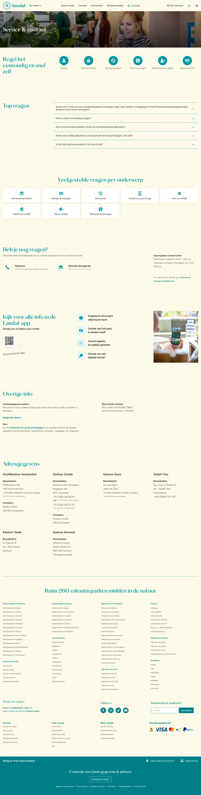

# Contact opnemen en veelgestelde vragen

**URL:** `/contact-en-vragen` (page title: "Contact opnemen en veelgestelde vragen") · **Occurrences:** 1 page in this run

## Section outline (top to bottom)

1. [Hero Banner with Booking Picker](../components/hero-banner-with-booking-picker.md)
2. [Quick Link Button Bar](../components/quick-link-button-bar.md)
3. [Image Tile Grid](../components/image-tile-grid.md)
4. [Quick Link Button Bar](../components/quick-link-button-bar.md)
5. [Contact Options Panel](../components/contact-options-panel.md)
6. [Promo Block with Image](../components/promo-block-with-image.md)
7. [Hero Banner with Booking Picker](../components/hero-banner-with-booking-picker.md)
8. [Feature List Columns](../components/feature-list-columns.md)
9. [Site Footer](../components/site-footer.md)
