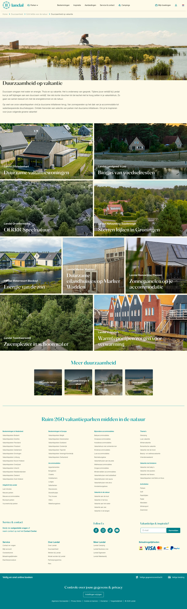

# Duurzaamheid op vakantie

**URL:** `/duurzaamheid/echt-liefde-voor-de-natuur/duurzaamheid-op-vakantie` (page title: "Duurzaamheid op vakantie") · **Occurrences:** 1 page in this run

## Section outline (top to bottom)

1. [Heading Bar](../components/heading-bar.md)
2. [Breadcrumb Trail](../components/breadcrumb-trail.md)
3. [Hero Banner with Booking Picker](../components/hero-banner-with-booking-picker.md)
4. [Image Tile Grid](../components/image-tile-grid.md)
5. [Image Tile Grid](../components/image-tile-grid.md)
6. [Image Tile Grid](../components/image-tile-grid.md)
7. [Image Tile Grid](../components/image-tile-grid.md)
8. [Hero Banner with Booking Picker](../components/hero-banner-with-booking-picker.md)
9. [Site Footer](../components/site-footer.md)
