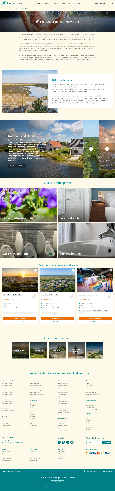

# Water besparen

**URL:** `/duurzaamheid/gezonde-natuur/water-besparen` (page title: "Water besparen") · **Occurrences:** 1 page in this run

## Section outline (top to bottom)

1. [Hero Banner with Booking Picker](../components/hero-banner-with-booking-picker.md)
2. [Listing with Filter Sidebar](../components/listing-with-filter-sidebar.md)
3. [Text Card with Image](../components/text-card-with-image.md)
4. [Photo Story Panel](../components/photo-story-panel.md)
5. [Image Tile Grid](../components/image-tile-grid.md)
6. [Image Tile Grid](../components/image-tile-grid.md)
7. [Listing with Filter Sidebar](../components/listing-with-filter-sidebar.md)
8. [Hero Banner with Booking Picker](../components/hero-banner-with-booking-picker.md)
9. [Site Footer](../components/site-footer.md)
