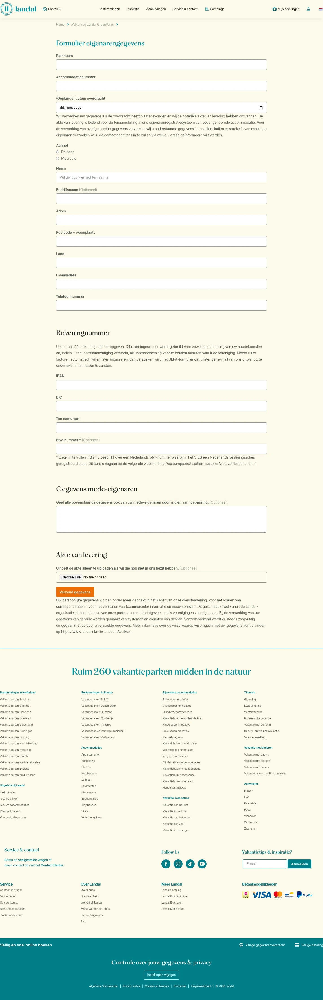

# Formulier eigenarengegevens

**URL:** `/eigenaren-welkom/formulier-eigenarengegevens` (page title: "Formulier eigenarengegevens") · **Occurrences:** 1 page in this run

## Section outline (top to bottom)

1. [Breadcrumb Trail](../components/breadcrumb-trail.md)
2. [Hero Banner with Booking Picker](../components/hero-banner-with-booking-picker.md)
3. [Checklist](../components/checklist.md)
4. [Form Section with Intro Text](../components/form-section-with-intro-text.md)
5. [Conditions Heading](../components/conditions-heading.md)
6. [Checklist](../components/checklist.md)
7. [Form Section with Intro Text](../components/form-section-with-intro-text.md)
8. [Site Footer](../components/site-footer.md)
