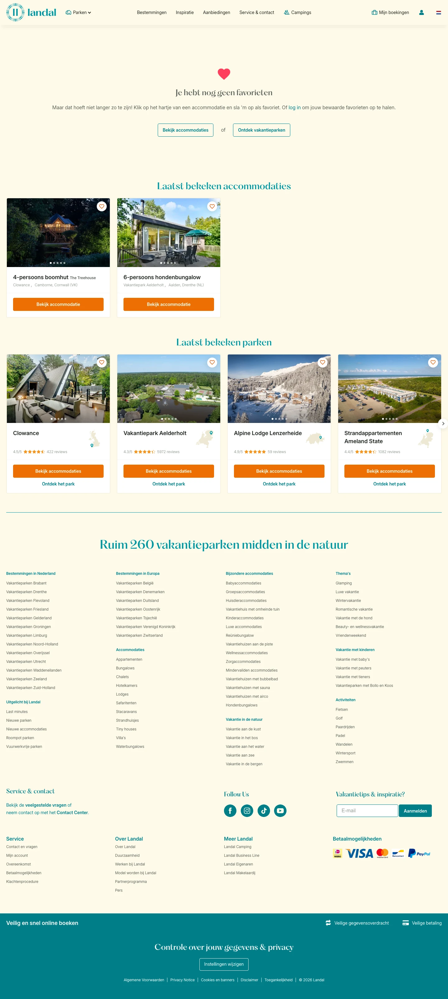

# Mijn favorieten bij Landal

**URL:** `/favorieten` (page title: "Mijn favorieten bij Landal") · **Occurrences:** 1 page in this run

## Section outline (top to bottom)

1. [Text Card with Image](../components/text-card-with-image.md)
2. [Listing with Filter Sidebar](../components/listing-with-filter-sidebar.md)
3. [Listing with Filter Sidebar](../components/listing-with-filter-sidebar.md)
4. [Site Footer](../components/site-footer.md)
