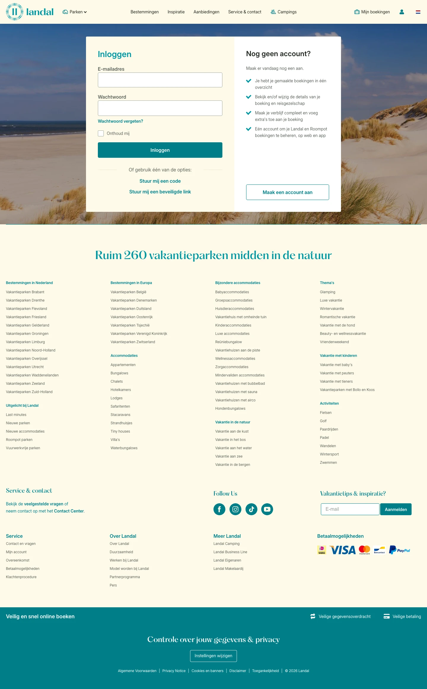

# Inloggen op je persoonlijke account voor jouw vakantie

**URL:** `/mijn-account/login` (page title: "Inloggen op je persoonlijke account voor jouw vakantie") · **Occurrences:** 1 page in this run

## Section outline (top to bottom)

1. [Form Section](../components/form-section.md)
2. [Park Listing with Filter Sidebar](../components/park-listing-with-filter-sidebar.md)
3. [Site Footer](../components/site-footer.md)
