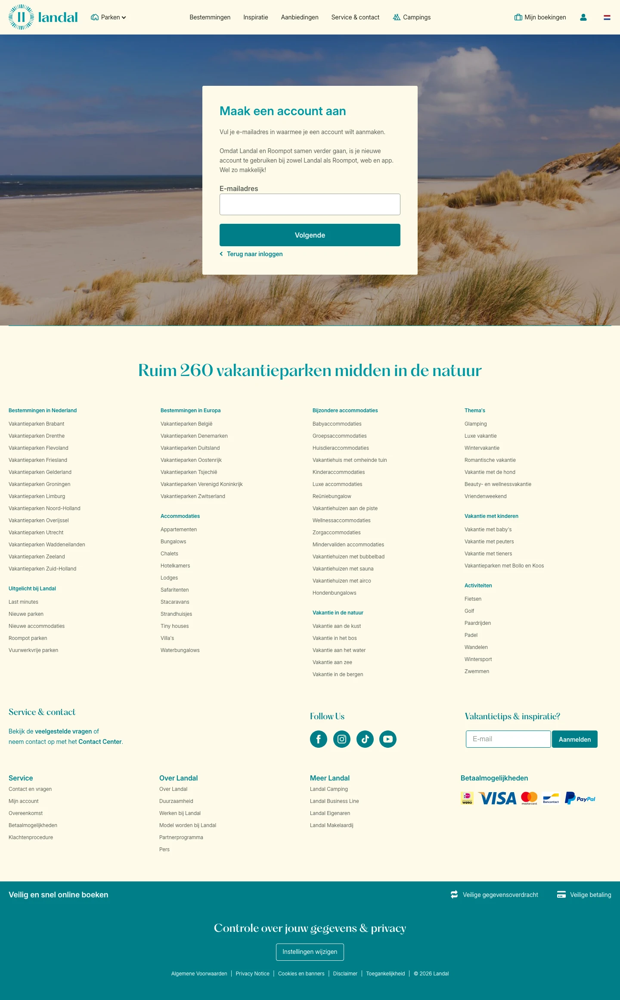

# Account aanmaken en registreren voor jouw voordelen

**URL:** `/mijn-account/registreren` (page title: "Account aanmaken en registreren voor jouw voordelen") · **Occurrences:** 4 pages in this run (also: mijn-account-wachtwoord-vergeten, mijn-account-activate-account, landal-blog-park-stories-live-cooking)

## Section outline (top to bottom)

1. [Accommodation Hero with Price Card](../components/accommodation-hero-with-price-card.md)
2. [Site Footer](../components/site-footer.md)
