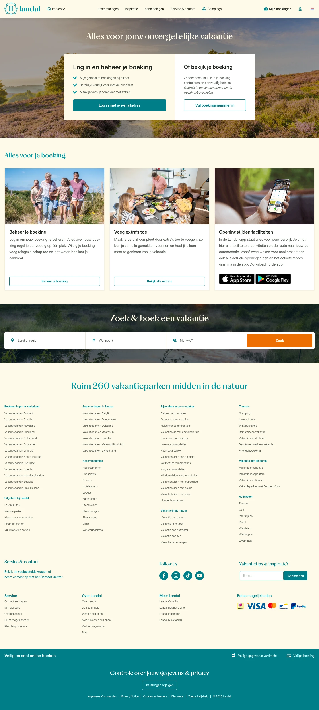

# Jouw boekingen en vakantieplannen in één overzicht

**URL:** `/mijn-boekingen` (page title: "Jouw boekingen en vakantieplannen in één overzicht") · **Occurrences:** 1 page in this run

## Section outline (top to bottom)

1. [Listing with Filter Sidebar](../components/listing-with-filter-sidebar.md)
2. [Image Tile Grid](../components/image-tile-grid.md)
3. [Breadcrumb Trail](../components/breadcrumb-trail.md)
4. [Site Footer](../components/site-footer.md)
