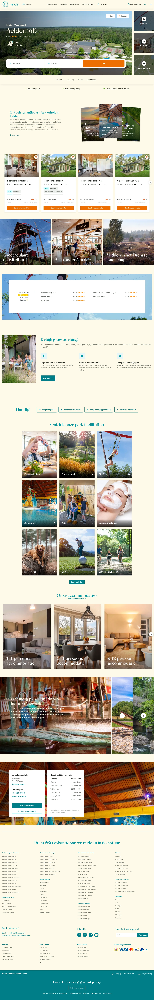

# Ontdek Vakantiepark Aelderholt in Aalden

**URL:** `/parken/aelderholt` (page title: "Ontdek Vakantiepark Aelderholt in Aalden") · **Occurrences:** 1 page in this run

## Section outline (top to bottom)

1. [Text Card with Image](../components/text-card-with-image.md)
2. [Breadcrumb Trail](../components/breadcrumb-trail.md)
3. [Hero Banner with Booking Picker](../components/hero-banner-with-booking-picker.md)
4. [Accommodation Type Carousel](../components/accommodation-type-carousel.md)
5. [Park Listing with Filter Sidebar](../components/park-listing-with-filter-sidebar.md)
6. [Quick Link Button Bar](../components/quick-link-button-bar.md)
7. [Quick Link Button Bar](../components/quick-link-button-bar.md)
8. [Park Listing with Filter Sidebar](../components/park-listing-with-filter-sidebar.md)
9. [Accommodation Type Carousel](../components/accommodation-type-carousel.md)
10. [Photo Story Panel](../components/photo-story-panel.md)
11. [Park Listing with Filter Sidebar](../components/park-listing-with-filter-sidebar.md)
12. [Site Footer](../components/site-footer.md)
