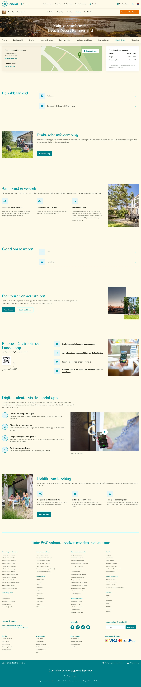

# Beach Resort Kamperland adres, route en plattegrond

**URL:** `/parken/beach-resort-kamperland/praktische-info` (page title: "Beach Resort Kamperland adres, route en plattegrond") · **Occurrences:** 3 pages in this run (also: parken-aelderholt-praktische-info, parken-beach-park-texel-praktische-info)

## Section outline (top to bottom)

1. [Hero Banner with Booking Picker](../components/hero-banner-with-booking-picker.md)
2. [Listing with Filter Sidebar](../components/listing-with-filter-sidebar.md)
3. [Quick Link Button Bar](../components/quick-link-button-bar.md)
4. [Hero Banner with Booking Picker](../components/hero-banner-with-booking-picker.md)
5. [Icon Feature Row](../components/icon-feature-row.md)
6. [Quick Link Button Bar](../components/quick-link-button-bar.md)
7. [Hero Banner with Booking Picker](../components/hero-banner-with-booking-picker.md)
8. [Promo Block with Image](../components/promo-block-with-image.md)
9. [Numbered Steps with Video Image](../components/numbered-steps-with-video-image.md)
10. [Quick Link Button Bar](../components/quick-link-button-bar.md)
11. [Site Footer](../components/site-footer.md)
