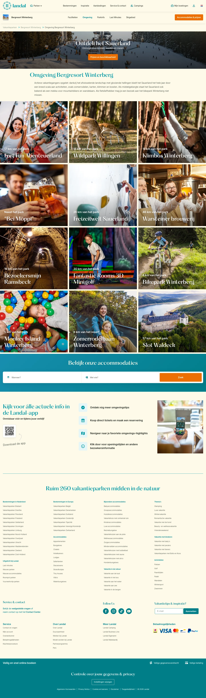

# Ontdek de omgeving van Bergresort Winterberg

**URL:** `/parken/bergresort-winterberg/omgeving` (page title: "Ontdek de omgeving van Bergresort Winterberg") · **Occurrences:** 3 pages in this run (also: parken-aelderholt-omgeving, parken-ameland-state-omgeving)

## Section outline (top to bottom)

1. [Breadcrumb Trail](../components/breadcrumb-trail.md)
2. [Breadcrumb Trail](../components/breadcrumb-trail.md)
3. [Hero Banner with Booking Picker](../components/hero-banner-with-booking-picker.md)
4. [Image Teaser Tiles](../components/image-teaser-tiles.md)
5. [Image Teaser Tiles](../components/image-teaser-tiles.md)
6. [Image Teaser Tiles](../components/image-teaser-tiles.md)
7. [Image Teaser Tiles](../components/image-teaser-tiles.md)
8. [Breadcrumb Trail](../components/breadcrumb-trail.md)
9. [Promo Block with Image and Button](../components/promo-block-with-image-and-button.md)
10. [Site Footer](../components/site-footer.md)
